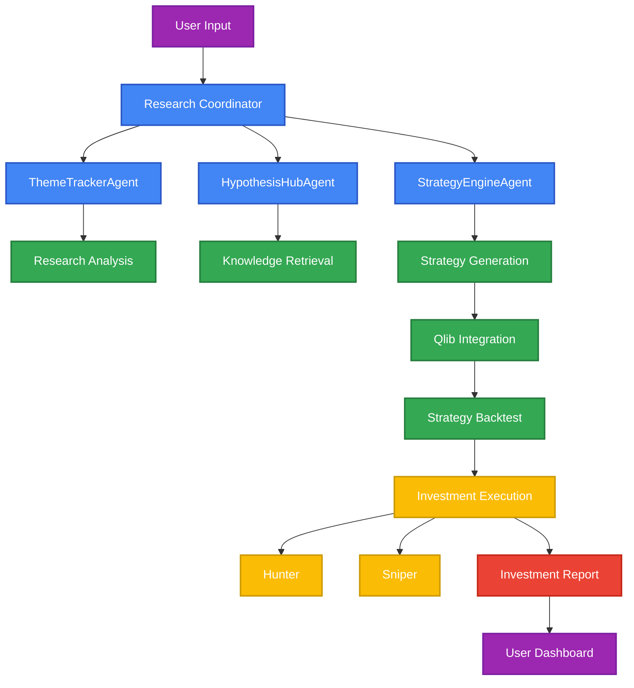

# Project-Minerva-AI Fund
A structured multi-agent financial research system for intelligent investment analysis.

## 🌟 Project Overview
Project Minerva is a **multi-agent system** designed for intelligent investment research, using advanced language models (LLM), quantitative backtesting (Qlib), and dynamic multi-agent orchestration to enable **structured research analysis** and **strategy generation** for financial decision-making.

This project integrates **Infosystem 2.0** strategy system components (like **Hunter** and **Sniper**) to provide real-time **investment execution** capabilities alongside **hypothesis generation** and **quantitative analysis**.

## 🧠 Core System Architecture

The system consists of specialized agents, each with its own role:



## 📊 Main Agents and Their Roles
- **Research Coordinator**: Coordinates the interaction between specialized agents.
- **ThemeTrackerAgent**: Tracks market themes and industries, providing structured research and hypothesis generation.
- **HypothesisHubAgent**: Gathers knowledge, verifies hypotheses, and structures investment assumptions.
- **StrategyEngineAgent**: Develops and refines strategies using quantitative models, with integration to Qlib for backtesting.
- **ExecutionAgent**: Executes real-time investment decisions by triggering Hunter and Sniper modules.
- **Hunter**: Generates buy signals based on multi-factor scoring.
- **Sniper**: Provides exit signals based on market behavior, including fake-out and trend reversal detection.

## 🚀 Features
- **Structured Research Analysis**: Turn investment hypotheses into structured analysis and insights.
- **Multi-Agent Collaboration**: Specialized agents work in harmony to process complex investment tasks.
- **Qlib Integration**: Quantitative backtesting to refine and optimize strategies.
- **LLM-Powered Reasoning**: Leverage advanced language models for in-depth reasoning and analysis.
- **Visual Reports**: Generate visual reports to help communicate data-driven investment insights.
- **Real-Time Strategy Execution**: Execute live trading strategies through Hunter and Sniper with dynamic risk adjustment.

## 🧩 Project Roadmap
- **Phase 1**: Basic Agent Framework Setup (ThemeTrackerAgent + HypothesisHubAgent)
- **Phase 2**: Strategy Engine Development with Qlib
- **Phase 3**: Multi-Agent Orchestration (Integrating Infosystem Strategy Modules)
- **Phase 4**: Web UI Interface for Strategy Visualization and User Interaction
- **Phase 5**: Real-Time Adaptive Strategy Execution with Hunter & Sniper

## 🔧 Installation
To get started with the Project Minerva, follow the installation steps below.

### Clone the Repository
```bash
git clone https://github.com/yourusername/project-minerva.git
cd project-minerva
```

### Install Dependencies with Poetry
```bash
poetry install
```

### Set Up Environment Variables
```bash
cp .env.example .env
# Edit .env with your OpenAI API key
```

## 🔥 Quick Start
To run a demo of the researcher agent, execute the following:

```bash
poetry run python scripts/run_agent_demo.py
```

To analyze an investment thesis:
```bash
poetry run python scripts/run_agent_demo.py --thesis "AI-powered financial agents with AlphaSense have demonstrated strong growth with ARR increasing from $150M to $420M over two years, positioning themselves as essential tools for financial research."
```

Generate an HTML report of the analysis:
```bash
poetry run python scripts/run_agent_demo.py --html
```

## 📚 Documentation
Detailed documentation for setting up, configuring, and expanding the system can be found in the docs directory.

## 🤝 Contributing
We welcome contributions! If you have ideas, suggestions, or improvements, feel free to fork the project and submit a pull request.

## 📜 License
This project is licensed under the MIT License. See the LICENSE file for more details.

## 🚨 Notice
This project is in active development and is not currently being used for external client deployment. It is a self-funded research project aimed at exploring multi-agent systems for financial decision-making.

Future releases will include additional strategy modules, real-time adaptive execution, and more refined backtesting systems.
