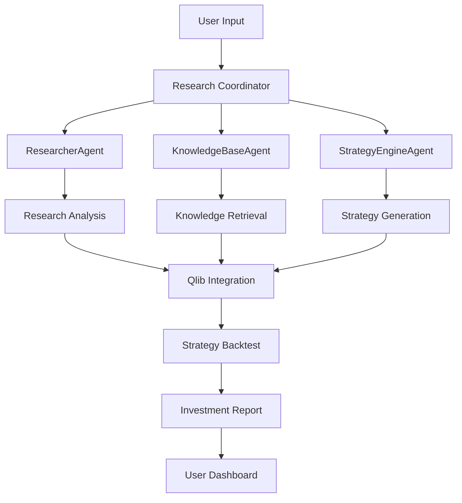

=======
# project-minerva
A structured multi-agent financial research system for intelligent investment analysis.
>>>>>>> 0ff29969a7ffa6bb1894c3135beae291b1a324dc
```markdown
# 🌟 Project Minerva
A structured multi-agent financial research system for intelligent investment analysis.

## 📊 System Architecture


🚀 **Features**

* 🔍 **Structured Research Analysis**: Turn investment hypotheses into structured analysis.
* 🤖 **Multi-Agent Collaboration**: Specialized agents working in concert to deliver insights.
* 📈 **Qlib Integration**: Integrate quantitative backtesting to refine strategies.
* 🧠 **LLM-Powered Reasoning**: Advanced language models power in-depth reasoning and analysis.
* 📊 **Visual Reports**: Generate visual reports that illustrate data-driven investment insights.

📦 **Installation**

```bash
# Clone the repository
git clone https://github.com/yourusername/project-minerva.git
cd project-minerva

# Install dependencies with Poetry
poetry install

# Set up environment variables
cp .env.example .env
# Edit .env with your OpenAI API key
```

🔧 **Quick Start**

```bash
# Run a simple researcher agent demo
poetry run python scripts/run_agent_demo.py

# Specify an investment thesis to analyze
poetry run python scripts/run_agent_demo.py --thesis "AI-powered financial agents with AlphaSense have demonstrated strong growth with ARR increasing from $150M to $420M over two years, positioning themselves as essential tools for financial research."

# Generate an HTML report
poetry run python scripts/run_agent_demo.py --html
```
<<<<<<< HEAD

🗺️ **Roadmap**

* Basic agent framework setup
* Researcher agent implementation
* Knowledge base integration
* Strategy engine with Qlib
* Multi-agent orchestration (using LangChain or CrewAI)
* Web UI interface
* Deployment pipeline

📚 **Documentation**
More detailed documentation is available in the `docs` directory.

🤝 **Contributing**
Contributions are welcome! Please feel free to submit a Pull Request.

📜 **License**
This project is licensed under the MIT License - see the LICENSE file for details.
```

=======

